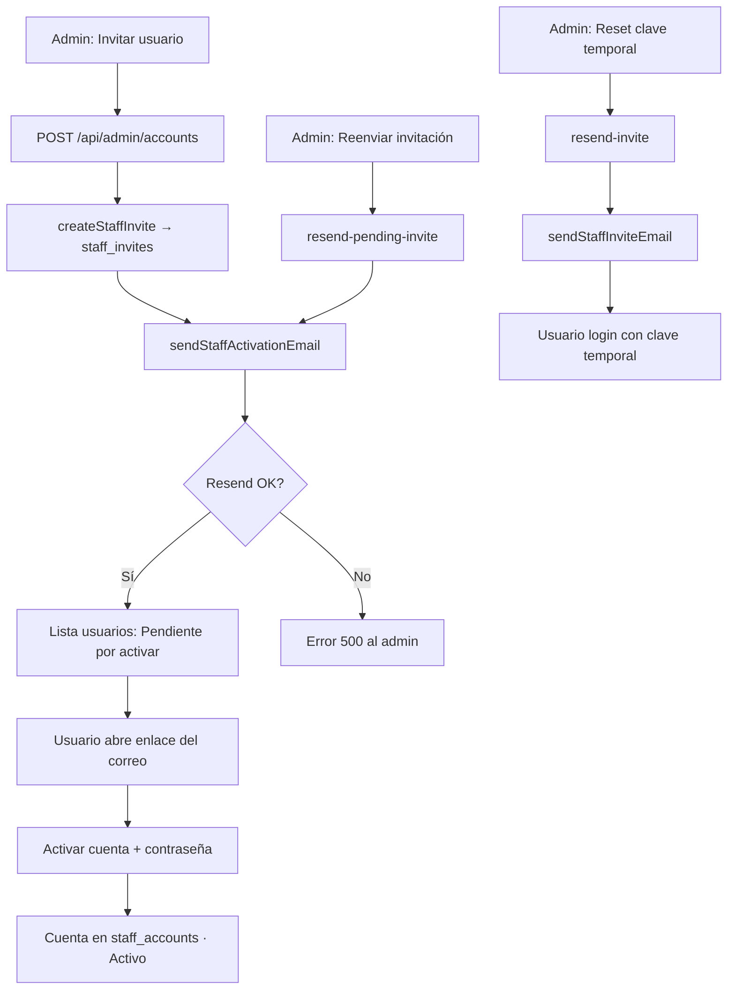
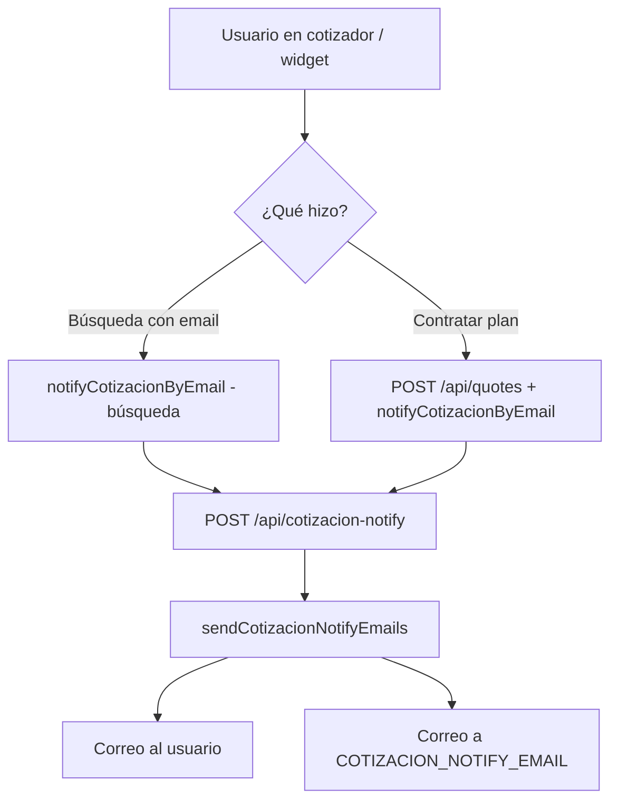

# Mapa de correos electrónicos — Cotizador Premium

Proveedor: **[Resend](https://resend.com)** (`resend` npm package).

## Variables de entorno requeridas

| Variable | Uso |
|----------|-----|
| `RESEND_API_KEY` | API key de Resend (obligatoria para cualquier envío) |
| `RESEND_COTIZACION_FROM_EMAIL` | **FROM** correos al usuario que cotiza → `cotizaciones@cotizadorpremium.cl` |
| `RESEND_EQUIPO_FROM_EMAIL` | **FROM** invitaciones staff y alertas internas → `equipo@cotizadorpremium.cl` |
| `EQUIPO_NOTIFY_EMAIL` | **TO** buzón del equipo para nuevas cotizaciones → `equipo@cotizadorpremium.cl` |
| `NEXT_PUBLIC_APP_URL` / `APP_BASE_URL` | Base URL para enlaces en correos de staff |

Archivos de implementación:
- `src/lib/email/send-staff-invite.ts` — staff (admin / ejecutivo)
- `src/lib/email/send-cotizacion-notify.ts` — cotizador público y widget

---

## 1. Staff — invitación y acceso

| # | Acción del usuario / sistema | Disparador (UI o API) | Función | Destinatario | Asunto | Contenido principal | Enlace / CTA |
|---|---------------------------|------------------------|---------|--------------|--------|---------------------|--------------|
| 1.1 | Admin invita usuario nuevo | `POST /api/admin/accounts` · botón **Invitar usuario** | `sendStaffActivationEmail` | Correo invitado | `Activa tu cuenta de administrador — Cotizador Premium` o `Activa tu cuenta de ejecutivo — Cotizador Premium` | Invitación con RUT (si aplica), botón **Crear mi cuenta** | `/cotizador/admin/activar-cuenta?token=…` o `/cotizador/ejecutivos/activar-cuenta?token=…` |
| 1.2 | Admin reenvía invitación pendiente | `POST /api/admin/accounts/[id]?action=resend-pending-invite` · **Reenviar invitación** | `sendStaffActivationEmail` | Correo invitado | Igual que 1.1 | Nuevo token, mismo flujo de activación | Igual que 1.1 |
| 1.3 | Admin resetea clave temporal (cuenta ya creada) | `POST /api/admin/accounts/[id]?action=resend-invite&realm=…` | `sendStaffInviteEmail` | Usuario staff existente | `Tu acceso de administrador — Cotizador Premium` o `Tu acceso de ejecutivo — Cotizador Premium` | Clave temporal + botón **Iniciar sesión** | `/cotizador/acceso` |

**Plantillas:** `src/lib/email/staff-invite-templates.ts`

**Estado en lista de usuarios:** Las acciones 1.1 y 1.2 crean un registro en `staff_invites` → aparece como **Pendiente por activar** hasta que complete el formulario de activación.

**Notas:**
- 1.1 y 1.2 son el flujo **principal** (enlace único, 7 días de vigencia).
- 1.3 es **legacy** (clave temporal en texto plano); solo aplica a cuentas ya existentes en `staff_accounts`.
- Si Resend falla, la API responde error 500; la invitación en BD puede quedar creada (1.1 / 1.2).

---

## 2. Cotizador público y widget

Cada disparo envía **2 correos en paralelo** (usuario + equipo interno).

| # | Acción del usuario | Disparador (UI) | API | Función | Destinatario | Asunto |
|---|-------------------|-----------------|-----|---------|--------------|--------|
| 2.1 | Usuario deja su correo y busca planes (sin contratar plan específico) | `public-cotizador-view.tsx` → `sendSearchCotizacionNotify` (una vez por sesión de búsqueda) | `POST /api/cotizacion-notify` | `sendCotizacionNotifyEmails` | **Usuario:** email ingresado | `Tu cotización de Isapre en Cotízalo Antes` |
| | | | | | **Interno:** `COTIZACION_NOTIFY_EMAIL` | `Nueva cotización — {email}` o con plan/búsqueda |
| 2.2 | Usuario solicita contratar / cotizar un plan concreto | `contract-plan-modal.tsx` tras `POST /api/quotes` exitoso | `POST /api/cotizacion-notify` | `sendCotizacionNotifyEmails` | Igual que 2.1 | Igual que 2.1 (incluye datos del plan en correo admin) |

**Plantillas:** `src/lib/email/cotizacion-notify-templates.ts`

**Contenido usuario:** resumen de criterios (región, edad, ingreso, cargas) + botón **Ver mi cotización**.

**Contenido admin:** detalle completo (criterios, filtros, plan si aplica, socio/widget de origen) + `replyTo` = correo del usuario.

**Prueba manual:**
```bash
npm run test-cotizacion-notify -- tu-correo@ejemplo.cl
```

---

## 3. Acciones que **no** envían correo hoy

| Acción | Comportamiento actual |
|--------|----------------------|
| Asignación automática de cliente/cotización a ejecutivo | Solo actualiza BD; sin email al ejecutivo |
| Asignación manual de cliente desde panel admin | Solo actualiza BD |
| Activación exitosa de cuenta staff | Redirige al panel; sin email de bienvenida |
| Cambio / recuperación de contraseña | Solo en app; sin email |
| Suspender / reactivar usuario | Solo BD |
| Cancelar invitación pendiente | Solo BD |

---

## 4. Diagrama de flujo (staff)



---

## 5. Diagrama de flujo (cotizaciones)



---

## 6. Verificación de configuración (local)

Comprobar que existan (sin exponer valores):

```bash
node -e "require('dotenv').config({path:'.env.local'}); console.log({
  RESEND_API_KEY: !!process.env.RESEND_API_KEY,
  RESEND_FROM_EMAIL: !!process.env.RESEND_FROM_EMAIL,
  COTIZACION_NOTIFY_EMAIL: !!process.env.COTIZACION_NOTIFY_EMAIL,
  APP_URL: !!process.env.NEXT_PUBLIC_APP_URL
})"
```

Estado esperado en desarrollo: las cuatro en `true`.

---

## 7. Observaciones / deuda técnica

1. **Branding mixto en cotizaciones:** las plantillas HTML dicen «Cotízalo Antes» pero el remitente configurado es «Cotizador Premium». Conviene unificar copy y marca.
2. **Sin email al ejecutivo** cuando se le asigna un lead o cliente (solo visible en el panel).
3. **Invitación vs. envío:** si el correo falla en 1.1, la invitación queda pendiente en BD; el admin puede usar **Reenviar invitación**.
